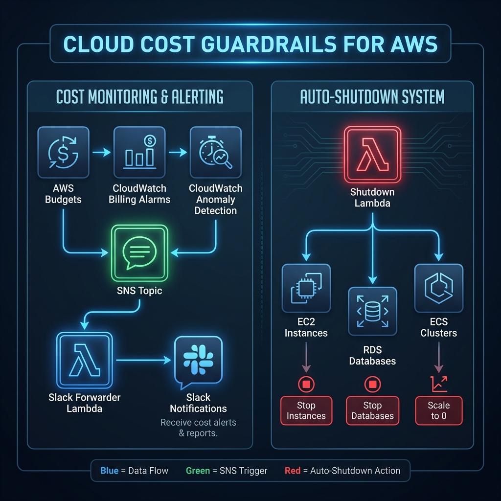

# 💸 Cloud Cost Guardrails for AWS

**Prevent surprise AWS bills with automated cost controls, alerts, and robust FinOps guardrails.**

This repository provides **startup-friendly FinOps guardrails** that work out of the box. It implements a multi-layered defense strategy: visibility (Budgets), detection (Anomaly Detection), and action (Auto-Shutdown).

---

## 🏗 Architecture



---

## 🚀 Quick Start

### 1. Prerequisite: Tofu or Terraform
This repo is compatible with [OpenTofu](https://opentofu.org/) and Terraform.

### 2. Configuration
Clone the example variables and fill in your details:
```bash
cp terraform.tfvars.example terraform.tfvars
# Edit terraform.tfvars with your email and (optional) Slack webhook
```

### 3. Deploy
```bash
tofu init
tofu apply
```

---

## 🛡 Features & Submodules

### 📊 Budgets & Alerts
- **Monthly Budget**: Configurable monthly spend limit with alerts at 80% usage.
- **Estimated Charges**: CloudWatch Alarm on total monthly estimated charges.
- **Anomaly Detection**: Monitors for unusual service-level spend patterns.

### 🛑 Auto-Shutdown (Cost-Cutting)
Automatically stops resources tagged with `AutoShutdown = true`.
- **Supported Resources**: EC2, RDS, and ECS (Fargate/Service Scaling).
- **Dry Run Mode**: Test what would be stopped without actually doing it.
- **Environment Aware**: Safety checks based on environment tags.

### 💬 Slack Integration
Forwards all AWS alerts (SNS) to a Slack channel with rich formatting.

---

## 🏷 Tagging Policy
To enable auto-shutdown on a resource, simply add the following tag:
- **Key**: `AutoShutdown`
- **Value**: `true`

---

## ⚙️ Variables

| Name | Description | Default |
| :--- | :--- | :--- |
| `alert_email` | Primary email for AWS Budget & Alarm notifications | `alerts@example.com` |
| `slack_webhook_url`| URL for Slack channel notifications | `""` |
| `monthly_budget_limit` | The dollar amount for your monthly budget | `100` |
| `environment` | Environment tag (dev, staging, prod) | `dev` |
| `aws_region` | AWS region for deployment | `us-east-1` |

---

## 🛠 Advanced Usage

### RDS & ECS Support
The shutdown Lambda automatically handles RDS instances and ECS services.
- **RDS**: Stops the instance if tagged.
- **ECS**: Scales the desired count to `0` for tagged services.

### Dry Run
Set `dry_run = "true"` in your vars to audit resources that would be stopped without taking action.

---

## 📚 Documentation & Resources
- **[Guardrail Strategy](docs/guardrail-strategy.md)**: Deep dive into the multi-layered defense logic.
- **[Billing Pitfalls](docs/common-bill-mistakes.md)**: Common AWS traps and how to avoid them.
- **[Examples](examples)**: Pre-configured templates for different environment setups.
- **[Variable Reference](#-variables)**: Full list of available configuration options.

---

## ✅ How to Verify

After running `apply`, you can confirm the guardrails are active:
1. **Budgets**: Go to **AWS Console > Billing > Budgets**. You should see `monthly-cost-budget`.
2. **Alarms**: Check **CloudWatch > Alarms**. Look for `billing-alarm`.
3. **Auto-Shutdown**: 
   - Tag a test EC2 instance with `AutoShutdown = true`.
   - Manually trigger the `auto-shutdown-dev` Lambda in the AWS Console.
   - Verify the instance stops.
4. **Slack**: If configured, you should see a "Slack Forwarder" Lambda. Test it by sending a mock message to the SNS topic `cost-cost-alerts`.

---

## 📜 Philosophy
> Alert early. Act automatically. Save money by default.